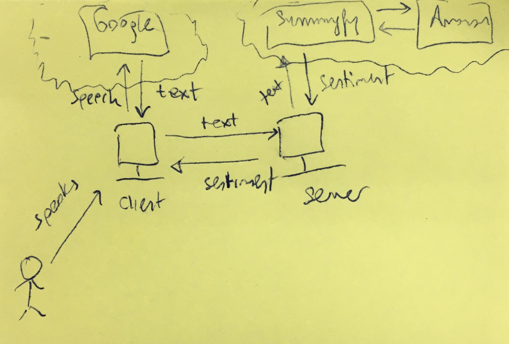

# INF443 Dağıtık Sistemler ve Uygulamalar

## Week 1: Introduction to Distributed Systems

Book `Distributed Computing with Python` by `Francesco Pierfederici`

> Parallel computing is the simultaneous use of more than one processor to solve a problem.

> Even though they both run on a single computer, a multithreaded application is an example of shared-memory architecture, whereas a multiprocess
application is an example of distributed memory architecture

> Distributed computing is the simultaneous use of more than one computer to solve a `common` big problem.

## Week 2: Concurrency vs Parallelism
 - [Concurrency](https://github.com/uzay00/GSU-Dersler/blob/main/INF443%20Da%C4%9F%C4%B1t%C4%B1k%20Sistemler%20ve%20Uygulamalar/Code/Week2/Threads.ipynb)
 - [Parallelism](https://github.com/uzay00/GSU-Dersler/blob/main/INF443%20Da%C4%9F%C4%B1t%C4%B1k%20Sistemler%20ve%20Uygulamalar/Code/Week2/MultiProcessing.ipynb)

### Amdahl's law

\\( T(n)  \geq S \times T(1) + P \times T(n) / n\\)

\(E = mc^2\)

```math
\(E = mc^2\)
```

The execution time of the algorithm described here on n processors is equal—and
generally greater—than the execution time of its serial part on one processor (that is,
S*T(1)) plus the execution time of its parallel part on one processor (that is, P*T(1))
divided by n: the number of processors.


## Week 3: Concurrency vs Parallelism II
### Compute pi emprically
Multiprocessing monte carlo simulation for calculating pi


Answer: [ComputePi.ipynb](https://github.com/uzay00/GSU-Dersler/blob/main/INF443%20Da%C4%9F%C4%B1t%C4%B1k%20Sistemler%20ve%20Uygulamalar/Code/Week2/ComputePi.ipynb) you need [multi_process_example.py](https://github.com/uzay00/GSU-Dersler/blob/main/INF443%20Da%C4%9F%C4%B1t%C4%B1k%20Sistemler%20ve%20Uygulamalar/Code/Week2/multi_process_example.py) python file.

 - Mustafa Batuhan CEYLAN's [Answer](https://gist.github.com/Frozander/9ae59942f8126a6bf7ebc86ebec07cbb)
 - Muhammed Nurullah GÜMÜŞ's [Answer](https://gist.github.com/silverdevelopper/bfca3910de39d9e3822d989794c6c2dc)

Example
 - [speech recognition](https://github.com/uzay00/GSU-Dersler/blob/main/INF443%20Da%C4%9F%C4%B1t%C4%B1k%20Sistemler%20ve%20Uygulamalar/Code/Week3/Ses%20Tanima.ipynb)


## Week 4: Client-Server architecture for speech analysis
 
Client-Server architecture 
 - Socket Programming [Lecture](https://github.com/uzay00/GSU-Dersler/blob/main/INF443%20Da%C4%9F%C4%B1t%C4%B1k%20Sistemler%20ve%20Uygulamalar/Code/Week5/Socket%20Programming.ipynb)
 - Client [Code](https://github.com/uzay00/GSU-Dersler/blob/main/INF443%20Da%C4%9F%C4%B1t%C4%B1k%20Sistemler%20ve%20Uygulamalar/Code/Week5/echo-client.py) and 
Server [Code](https://github.com/uzay00/GSU-Dersler/blob/main/INF443%20Da%C4%9F%C4%B1t%C4%B1k%20Sistemler%20ve%20Uygulamalar/Code/Week5/echo-server.py)


Combination of speech recognition and text mining
 - Simple Speech Analysis [Code](https://github.com/uzay00/GSU-Dersler/blob/main/INF236%20Programlama%20Uygulamalar%C4%B1/Ses%20Tanima.ipynb)


- 

### Homework2 - Speech Analysis with Client-Server Arc.
Using socket programming build 
- a client that can connect to `Google` for speech-to-text
- a multi-threading server that can connect to `Summarify` for sentiment analysis

and let them communicate through internet with TCP


> Service-oriented architecture" (SOA) / __microservices__:
splitting a large software application into multiple services
(on multiple nodes) that communicate via RPC.

Use libraries
 - https://pypi.org/project/SpeechRecognition/
 - https://pypi.org/project/sumapi/


### Communication between two computers using python socket
> This program is used for sending "small letters string" from the client and getting "capital letters" from the server

https://stackoverflow.com/questions/11352855/communication-between-two-computers-using-python-socket


Command-line approach to finding your IP

 - OSX/Linux: ifconfig 
 - Windows: ipconfig /all


## Week 5: Creating a Webapp using streamlit

 - Introduction 2 [streamlit](https://hersanyagci.medium.com/introduction-to-streamlit-for-machine-learning-web-app-cd89c4181c33)
 - Model Deployment [with Streamlit on AWS](https://hersanyagci.medium.com/model-deployment-with-streamlit-on-aws-ec2-f52ab42d7813)
 - Streamlit [Cheatsheet](https://share.streamlit.io/daniellewisdl/streamlit-cheat-sheet/app.py)

### Cloud Computing
- Amazon Simple Storage Service (Amazon S3); nesne depolama 
- Amazon Elastic Compute Cloud (EC2): Buluttaki sanal sunucu hizmetidir


> Cloud Computing often referred to as “the cloud”, in simple terms means storing or accessing your data and programs over the internet rather than your own hard drive.

### Homework3 - Speech Analysis with Streamlit on AWS
 - get [help](https://discuss.streamlit.io/t/speech-to-text-on-client-side-using-html5-and-streamlit-bokeh-events/7888) 

